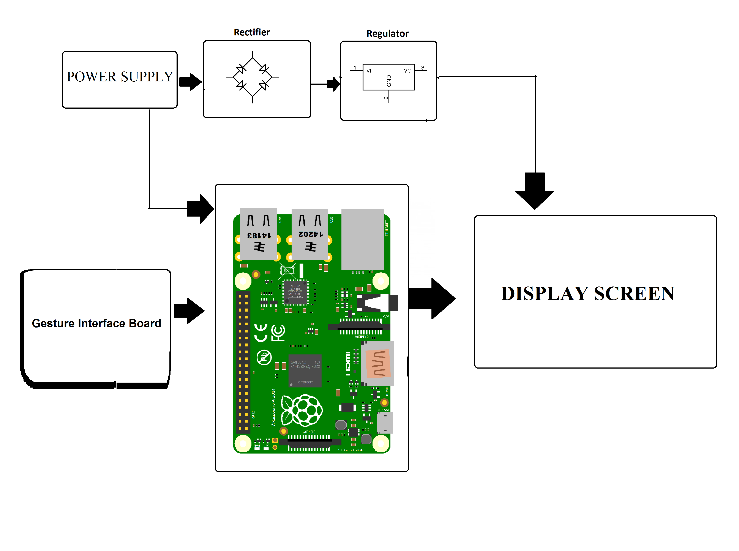

## Concept
It is a very simple concept that is illustrated in figure 1.1. A screen is placed behind a two-way mirror. By using a black and white graphical user interface (GUI) only the white colors will penetrate the mirror, resulting in an effect that makes it appear as if the mirror itself is a screen. The idea of an intelligent mirror is to further this enhancement to include artificial intelligence as well.

Illustration of what a smart mirror is.

