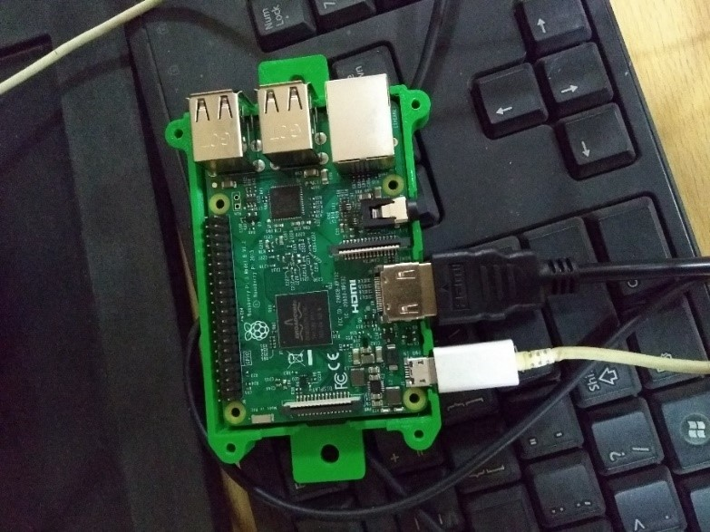

### Raspberry PI 3
In order for the mirror to do anything useful at all (beside being a standard mirror) a computational device is required to operate the camera, provide the GUI. The embedded device chosen is the Raspberry Pi 3 Model B. RPI is probably, alongside Arduino, the most famous embedded device for its cheap price, active community and numerous accessories that makes the RPI suitable for all kinds of fun DIY projects from making a homemade Gameboy to making a security monitoring system. One of the research goals of this thesis was to examine if the RPI is a suitable embedded device for the intelligent mirror, or if other potential embedded devices should be researched.

I used 3d printer to print the 3d case for Raspberry Pi

Raspberry Pi 3 Model B

 

Raspberry Pi 3 case printed by 3D printer

