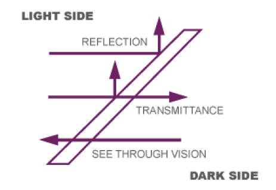

### Two-way Mirror

  
  
Illustration of how two-way mirrors work

A two-way mirror is a mirror that is partially reflective and partially transparent. This property allows the mirror to be reflective from one side (if the room is bright) and transparent from the other side (if the room is dark). Typically, these types of mirrors are found in interrogation chambers. This property is crucial for the project to work. It is exactly its ability to be transparent from one side that allows the monitor to shine through to the other side while still behaving as a mirror. Two-way mirrors are made by coating the glass with a thin and almost-transparent layer of metal (usually aluminium). The effect is that some light is reflected while the rest will penetrate the glass. The mirror is bidirectional - initially it does not matter which side you are looking from. The light passes equally in both directions. However to achieve the desired effect one side must be kept dark while the other is bright. The backside of the mirror will be coated in black to simulate the darker room. The monitor creates light on its own so its screen contents will be able to shine through from the dark side. By using a black and white interface only the white color will travel through the mirror. However, a problem with LCD monitors is that it uses background lighting to light up the diodes, displaying colors. However a side-effect is that the black pixels will not be truly black because of the back-lighting. Ideally the black pixels would be totally "off" - emitting no light at all. Newer types of monitors that employs technology such as OLED monitors does not use back-lighting. Unused pixels will completely dim themselves. The downside is however that such monitors are relatively new to the market and rather expensive. For this project an older LCD laptop monitor was used. However, the mirror was designed to be highly modular - allowing replacing most of the hardware.
