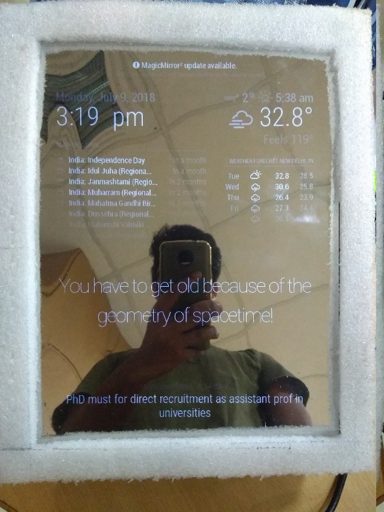
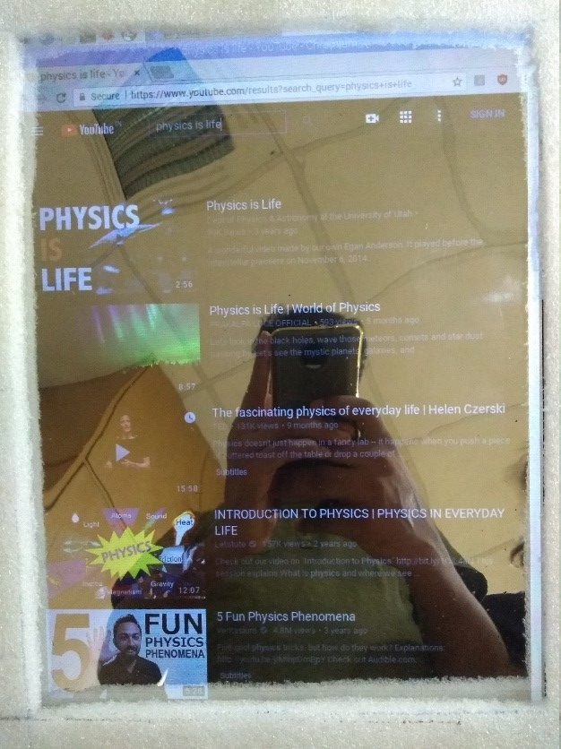

# Results and discussion

  
  
Modules on Intelligent Mirror

 

  
  
Playing YouTube in Intelligent Mirror

My finished product, as shown above, is demonstrated on our mirror hardware model. The hardware is simple, and elegant enough to demonstrate my module structure. My real focus was towards the design of my overall module class structure. My final project has a few demonstrations of the module class, such as the weather module, calendar module, comments module and the RSS news feeder module. These modules, while simple, do demonstrate the feasibility of being able to create most ideas in JavaScript. As of right now, our platform is able to support simple JavaScript applications, and because of its scalability, it can be run on more than just our current hardware model.

Originally, I aimed to create a mirror that would act as a personal assistant to both developers and general consumers alike. However, the sheer scope of the idea, along with the vagueness of such a complex concept, forced me to rethink our idea into a more viable option. Eventually, I settled on the idea of focusing on the creation of the open source platform, specifically tailored for DIY developers. I felt that there was no effective open source projects that allowed for a hobbyist to create their own mirror, similar to mine, and thus I focused on creating a model that would allow for easier application development. I feel that our goal in creating such a model was achieved, as the feedback I have received helps confirm that this platform looks and feels easy to develop with. I hope that in the future, perhaps more work and more effort can be added, either by me or others, in order to further improve my platform.
